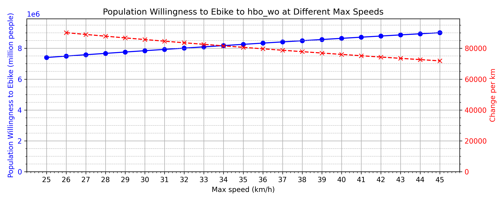

# Design of AI-driven Business Operation

This project explores the application of AI and data-driven methods to analyze and optimize business operations, with a focus on transportation, demographics, and spatial data in the Netherlands. The repository contains code for data loading, preprocessing, analysis, and visualization, as well as Jupyter notebooks for various research topics. The use of heatmaps for various metrics across the country is heavily employed, such as the following example of the number of extra inhabitants willing to cycle to Elementary School if the neighbourhoods with detour factors above 2 had them reduced by 50 %:


The main recommendation for increasing the number of people willing to cycle to their educational institutions is increasing e-bike speeds. To estimate this, we find the actual average speeds of ebikes and pedelecs. Ebikes have a speed limit of 25 km/h, but an average speed of 21 km/h, whereas pedelecs have a speed limit of 45 km/h and an average speed of 28.8. Using this we interpolate the average speed that would be achieved at hypothetical new speed limits from 26 km/h to 45 km/h for ebikes. From this we estimate ~1.5 million new people would be willing to ebike if the speed limit is increased to 45 km/h.



For a simple introduction to using the tools in this repository, look at the following notebooks:
- `Topic1/choropleths_and_willingness.ipynb` for how to create choropleths (geographical heatmaps) and calculate willingness to cycle
- `Topic1/top_detour.ipynb` for extensive analysis for finding the places where most people are the most affected by detours
- `Topic2/decision_tree_demo.ipynb` for an introduction to the dataloading for ml
- `Topic2/*` for notebooks producing classification results
- `Topic3/ebike_speeds` for the calculation of the impact of changing the legal maximum speed on potential ridership


## Project Structure

- `Topic1/`, `Topic2/`, `Topic3/`  
  Jupyter notebooks for each topic. Together they form the enterity of the analysis performed in this project. These notebooks will can skip training models if results are available and you wish to do so.
- `codebase/`  
  Core Python package with modules for data loading, calculations, classification, and plotting.
- `data/`  
  Contains raw the datasets small enough to be pushed to git and results generated by the notebook. 
- `graphics/`  
  Output figures and visualizations.
- `neural_net_checkpoints/`  
  Saved model checkpoints.

## Setup

1. **Clone the repository**
   ```sh
   git clone https://github.com/<your-username>/Design-of-AI-driven-business-operation.git
   cd Design-of-AI-driven-business-operation
   ```

2. **Install dependencies**
   ```sh
   pip install -r requirements.txt
   ```

3. **Data**
   - Since the ODIN and punt_tot_punt data was shared with us through the TUe canvas page, we cannot provide a script that downloads, unzips and places the files in the right place. Instead you will simply have to make sure that the files are placed in the datafolder. In addition you will need the following file: https://geodata.cbs.nl/files/Wijkenbuurtkaart/WijkBuurtkaart_2023_v2.zip and the "buurt_to_PC_mapping.csv" from https://www.cbs.nl/nl-nl/maatwerk/2023/35/buurt-wijk-en-gemeente-2023-voor-postcode-huisnummer 

## Usage

### Running Notebooks

Open any notebook in `Topic1/`, `Topic2/`, or `Topic3/` using JupyterLab or VS Code. Each notebook is self-contained and demonstrates a specific analysis or experiment.

### Using the Codebase

You can import and use the core functions in your own scripts or notebooks. For example:

```python
from codebase import load_demograhics, load_buurt_data, plot_confusion_matrix
```

See [codebase/__init__.py](codebase/__init__.py) for available imports.

## Main Features

- **Data Loading:** Utilities for loading the various datasets.
- **Preprocessing:** Filtering, cleaning, and mapping of data (e.g., postcode to neighborhood).
- **Analysis:** Functions for calculating willingness to cycle, detour factors, and classification models.
- **Visualization:** Plotting functions for geospatial data heatmaps and confusion matrices.

## License

This project is for academic and research purposes. See `LICENSE` for details (if available).
